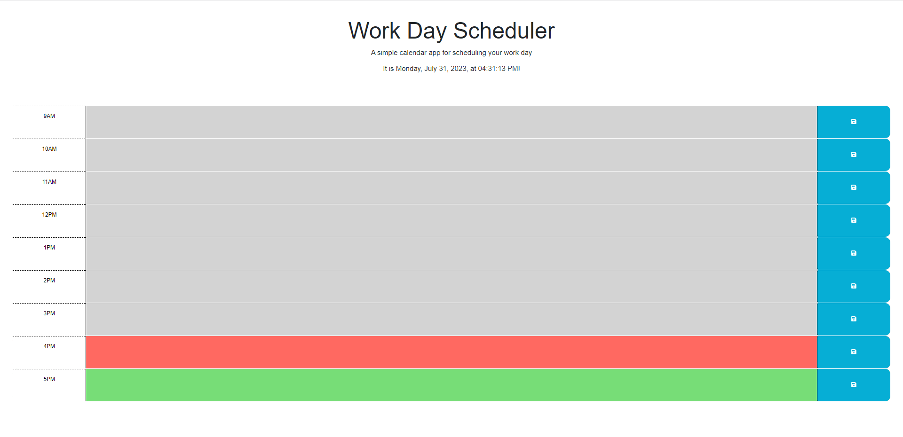
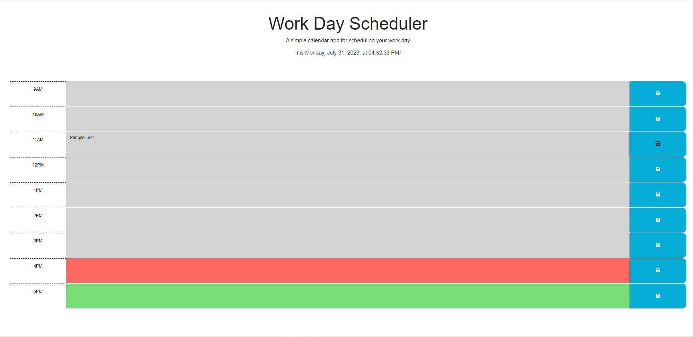

# Work_Day_Scheduler
## Description

When creating this project, I set out to create an interactive Work Day Scheduler in order to help people better plan out their work day. By completing this assignment, I gained a better understanding of JQuery, and the dayJS function.

## Installation

N/A

## Usage

You can access the website here: https://jeslocascio.github.io/Work_Day_Scheduler/

When you open this page, you will be presented with a screen that looks like this:

As opposed to this screenshot, the header of your screen will showcase the accurate time of whenever you a viewing the site. 

Additonally, depending on the time of day you are viewing, the time slots will be one of three colors: Grey, Red, or Green. 

If the time slot is Grey, that means that hour has already passed for the day. If the time slot is Red, then that means you are currently in that hour. If the time slow is Green, that means that hour is in the future.

Another feature of the site is its use of text boxes and save buttons to record planned activities, as seen below:

As seen in the above image, you can click on the save button on the right side of the screen to record any typed out activies you plan to do that day. They will even still be there after you refresh the tab, or decide to close and reopen it.

## Credits

Rutgers Fullstack Flex Coding Bootcamp provided the starter code.

## License

MIT License

Please refer to the LICENSE in the repo for more information.

## Features

Clock showing the accurate time.

Text boxes to save planned activities.

Save buttons

Color-Coordinated time slots to show the time of day.